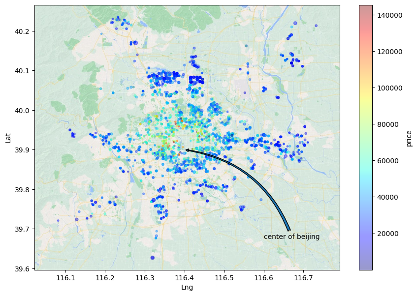
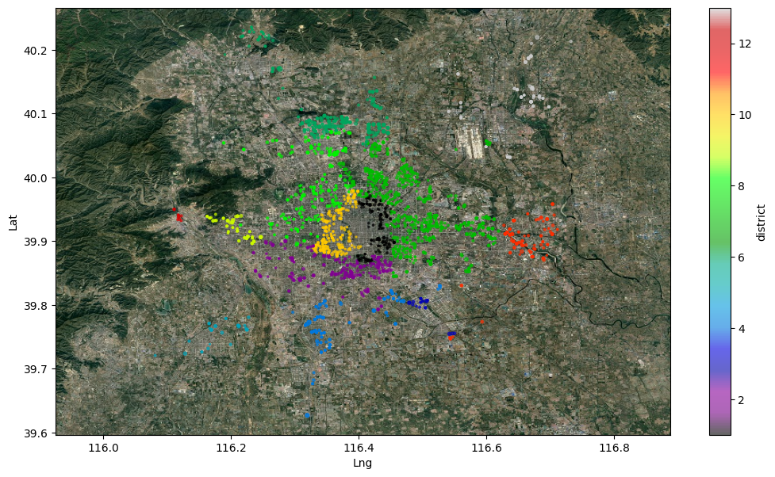

# Housing price in Beijing

In this repository, we have analyzed and reviewed the housing sales data of Beijing (see the dataset on [Kaggle](https://www.kaggle.com/datasets/ruiqurm/lianjia)).

## About Dataset

This dataset contains 318,851 rows and 26 columns. The name of each column along with its description is provided in the table below.

| column | Description |
| :---: | :--- |
| `url` | the url which fetches the data |
| `id` | the id of transaction |
| `Lng` | Lng coordinates, using the BD09 protocol. |
| `Lat` | Lat coordinates, using the BD09 protocol. |
| `Cid` | community id |
| `tradeTime` | the time of transaction |
| `DOM` | active days on market.Know more in [here](https://en.wikipedia.org/wiki/Days_on_market). |
| `followers` | the number of people follow the transaction. |
| `totalPrice` | the total price |
| `price` | the average price by square |
| `square` | the square of house |
| `livingRoom` | the number of living room |
| `drawingRoom` | the number of drawing room |
| `kitchen` | the number of kitchen |
| `bathroom` | the number of bathroom |
| `floor` | the height of the house. I will turn the Chinese characters to English in the next version. |
| `buildingType` | including tower (1), bungalow (2)，combination of plate and tower (3), plate (4). |
| `constructionTime` | the time of construction |
| `renovationCondition` | including other (1), rough (2), Simplicity (3), hardcover (4) |
| `buildingStructure` | including unknown (1), mixed (2), brick and wood (3), brick and concrete (4), steel (5) and steel-concrete composite (6). |
| `ladderRatio` | the proportion between number of residents on the same floor and number of elevator of ladder. It describes how many ladders a resident have on average. |
| `elevator` | have (1) or not have elevator (0) |
| `fiveYearsProperty` | if the owner have the property for less than 5 years. |
| `subway` | have access to subway (1) or not (0) |
| `district` | district number |
| `communityAverage` | |

## Preprocessing

First, we preprocessed the existing dataset. We removed unnecessary data. Then we imputed or deleted missing data. After that, we formatted the data into appropriate types. Finally, we removed outliers from the dataset. After cleaning the data, we added new information to the dataset that would be useful in the analysis phase using other data. The final processed dataset is saved in the file [housing-data-proccessed.csv](data/proccessed/housing-data-proccessed.csv).

## Analysis

First, we obtained general information from the dataset using bar charts. After that, we examined the impact of various factors on prices using different charts. In the next step, we displayed the distribution of houses based on price on the city map. Additionally, we categorized the houses based on their districts and obtained general information for each district. Finally, we plotted and examined various time-series charts, such as price changes over time.

## Data Visualization

    
     
    <i>Effect of <code>distanceToCapital</code> on <code>price</code></i>

 

<table align="center">
    <tr>
        <td align="center">
            
             
            <i>Effect of <code>elevator</code> on <code>price</code></i>
        </td>
        <td align="center">
            
             
            <i>Effect of <code>subway</code> on <code>price</code></i>
        </td>
    </tr>
</table>

 

    
     
    <i>This scatter map shows the distribution of houses with respect to their prices.</i>

 

    
     
    <i>This scatter map shows the distribution of houses with respect to their districts.</i>

<table align="center">
    <tr>
        <td align="center">
            
             
            <i>This chart illustrates the variations in house prices over time.</i>
        </td>
        <td align="center">
            
             
            <i>This chart displays the number of houses sold in the city center.</i>
        </td>
    </tr>
</table>
